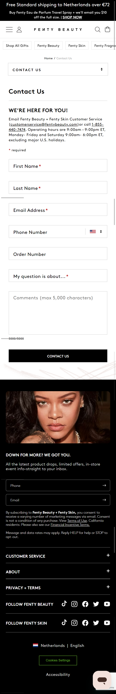
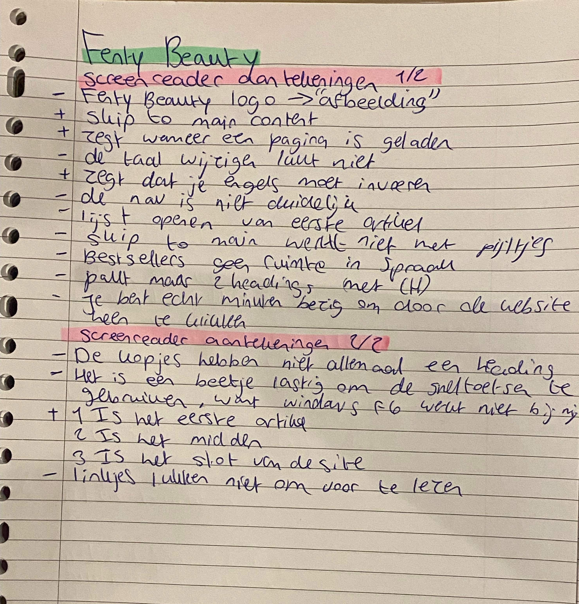
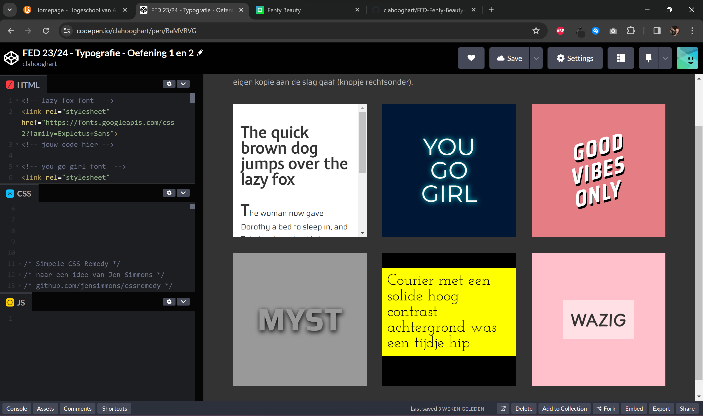
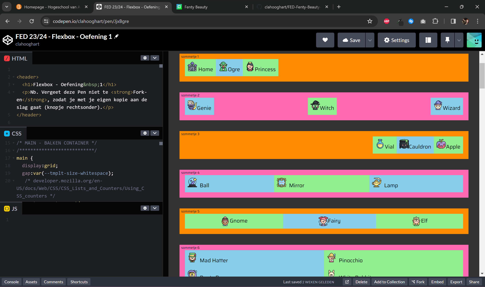
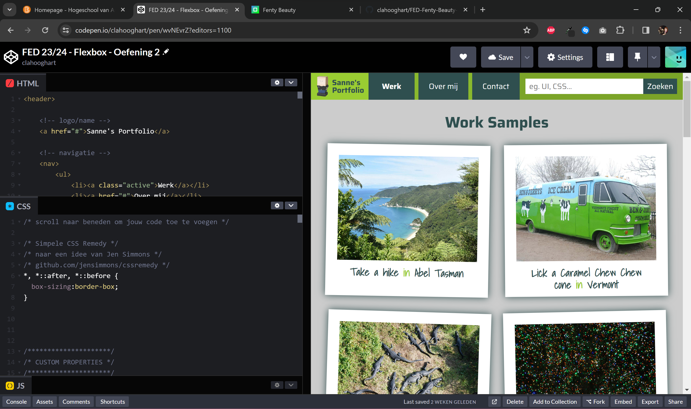
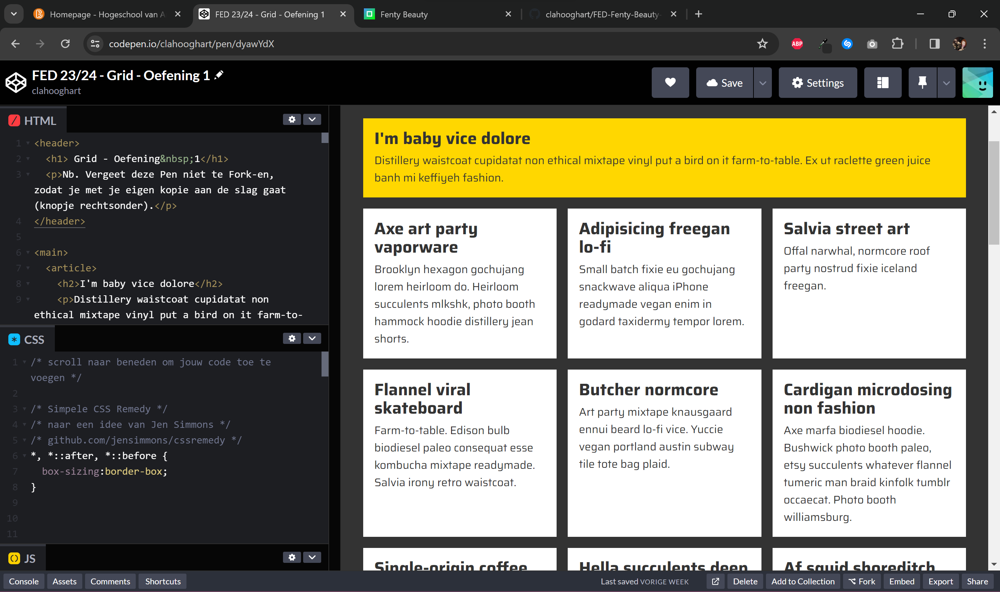
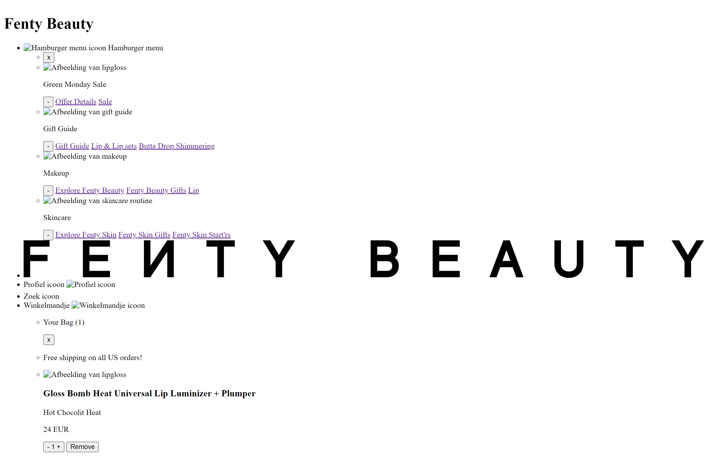
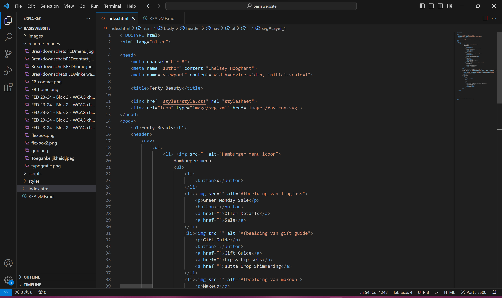
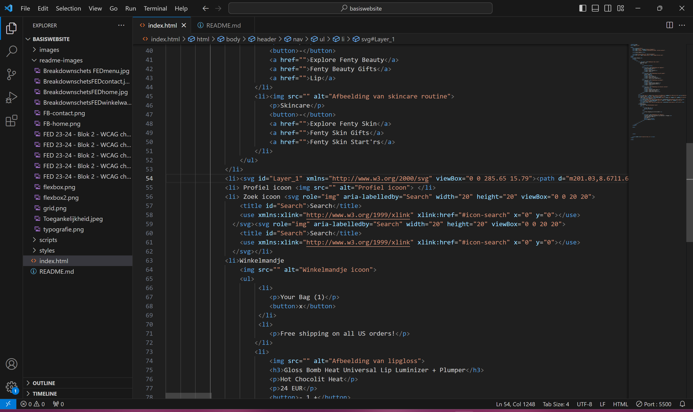
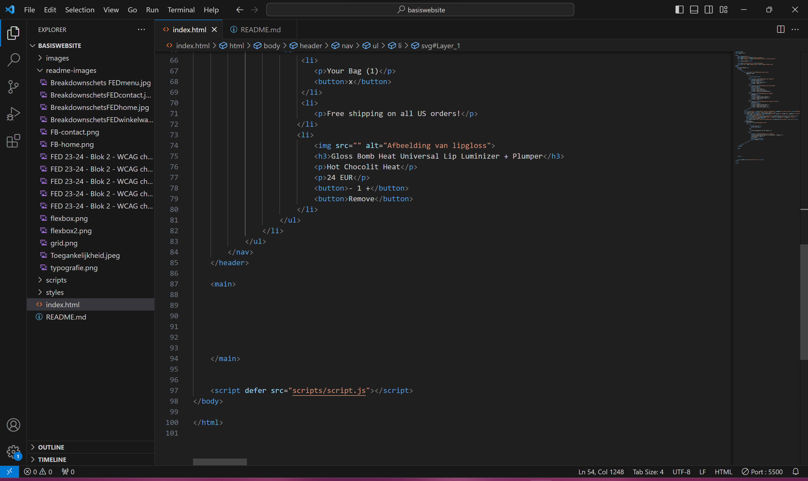

# Procesverslag
Markdown is een simpele manier om HTML te schrijven.  
Markdown cheat cheet: [Hulp bij het schrijven van Markdown](https://github.com/adam-p/markdown-here/wiki/Markdown-Cheatsheet).

Nb. De standaardstructuur en de spartaanse opmaak van de README.md zijn helemaal prima. Het gaat om de inhoud van je procesverslag. Besteedt de tijd voor pracht en praal aan je website.

Nb. Door *open* toe te voegen aan een *details* element kun je deze standaard open zetten. Fijn om dat steeds voor de relevante stuk(ken) te doen.

## Jij

  
uitwerken voor kick-off werkgroep

  ### Auteur:
  Chelsey Hooghart

  #### Je startniveau:
  Blauw

  #### Je focus:
  Surface Plane
 

## Fenty Beauty

  
Ik heb gekozen om de website Fenty Beauty van Rihanna na te maken. De website heeft een groot surface level dus ik ga mijn best doen om hieruit te kiezen wat ik na bouw.

  ### Je opdracht:
  <a href="https://fentybeauty.com/en-nl">Fenty Beauty website</a>

  #### Screenshot(s) van de eerste pagina (small screen): 
  Homepagina  
  

  #### Screenshot(s) van de tweede pagina (small screen):
  Contact  
  
 

## Toegankelijkheidstest 1/2 (week 1)

  
uitwerken na test in 2e werkgroep

  ### Bevindingen
  Lijst met je bevindingen die in de test naar voren kwamen:
  
  
  ### Formulier
  
  
  
  
  

## Breakdownschets (week 1)

  
uitwerken na afloop 3e werkgroep

  ### de hele pagina: 
  
  
  
  ### dynamisch deel (bijv menu): 
  

  ### wellicht nog een dynamisch deel (bijv filter): 
  

## Voortgang 1 (week 2)

  
uitwerken voor 1e voortgang

  ### Stand van zaken
  De afgelopen weken heb ik filmpjes gekeken en oefeningen gemaakt in codepen. Omdat ik best wel lang niet gecodeerd heb hebben de oefeningen  mij wel erg geholpen om het weer op te frissen.
  
  Typografie oefening:
   

  Flexbox oefening:
  
  

  Grid oefening:
  

   Ook heb ik mijn breakdownschets gemaakt. Ik heb een aantal kleine dingen aangepast over hoe ik dus niet meerdere H1's kan maken. Per pagina mag je maar 1 H1 en ik had er meerderen. Deze heb ik vervangen voor H2's. Voor de rest was de feedback wel positief over de breakdownschets. Ik ben zelf nog een beetje onzeker of ik wel zo'n complexe website zou kunnen coderen en of het haalbaar was voor de blauwe piste. De docent heeft mij verteld dat het wel gewoon te doen is dus ik zal mijn best doen.

  ### Verslag van meeting
  hier na afloop snel de uitkomsten van de meeting vastleggen

  - Artiekelen mogen in secties en andersom. 
  - Let op dat je begint met custom properties.
  - In de oefeningen staat 80% van code die je nodig hebt voor je site.
  - Verrander de H1s naar H2 en zet een H1 op hidden.

## Voortgang 2 (week 3)

  
uitwerken voor 2e voortgang

  ### Stand van zaken
  Hier ben ik begonnen met het schrijven van mijn HTML. Ik heb geprobeerd om de navigatie de coderen. 
  
  
  De HTML code: 
  
  
  

  ### Verslag van meeting
  hier na afloop snel de uitkomsten van de meeting vastleggen

  - Tip over het stijlen van het hamburger menu met details en summary
  - Winkelmandje weghalen of met extra tijd doen
  - Flexbox justify content center gap 0.5 em
  - a gebruiken in de nav

## Toegankelijkheidstest 2/2 (week 4)

  
uitwerken na test in 9e werkgroep

  ### Bevindingen
  Lijst met je bevindingen die in de test naar voren kwamen (geef ook aan wat er verbeterd is):

## Voortgang 3 (week 4)

  
uitwerken voor 3e voortgang

  ### Stand van zaken
  hier dit ging goed & dit was lastig (neem ook screenshots op van delen van je website en code)

  ### Agenda voor meeting
  samen met je groepje opstellen

  | student 1      | student 2          | student 3    | student 4        |
  | ---            | ---                | ---          | ---              |
  | dit bespreken  | en dit             | en ik dit    | en dan ik dat    |
  | en dat ook nog | dit als er tijd is | nog een punt | dit wil ik zeker |
  | ...            | ...                | ...          | ...              |

  ### Verslag van meeting
  hier na afloop snel de uitkomsten van de meeting vastleggen

  - punt 1
  - punt 2
  - nog een punt
  - ...

## Eindgesprek (week 5)

  
uitwerken voor eindgesprek

  ### Je uitkomst - karakteristiek screenshots:
  

  ### Dit ging goed/Heb ik geleerd: 
  Korte omschrijving met plaatjes

  

  ### Dit was lastig/Is niet gelukt:
  Korte omschrijving met plaatjes

  

## Bronnenlijst

  
continu bijhouden terwijl je werkt

  Nb. Wees specifiek ('css-tricks' als bron is bijv. niet specifiek genoeg). 
  Nb. ChatGpT en andere AI horen er ook bij.
  Nb. Vermeld de bronnen ook in je code.

  1. bron 1
  2. bron 2
  3. ...

