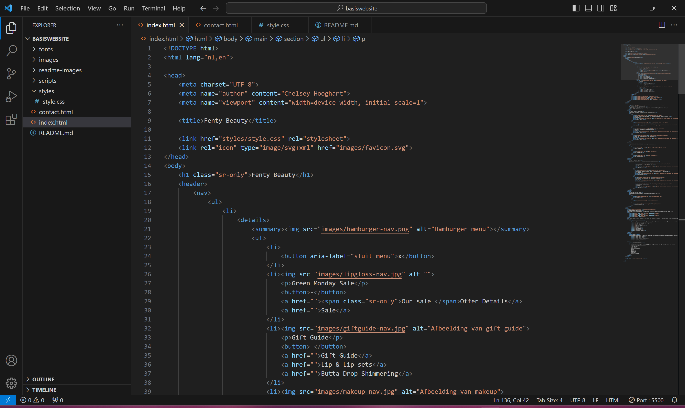
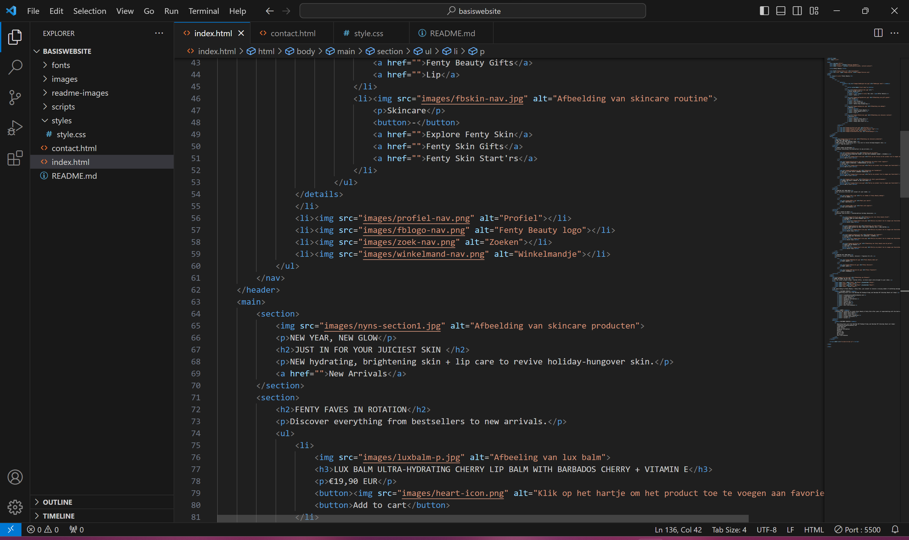
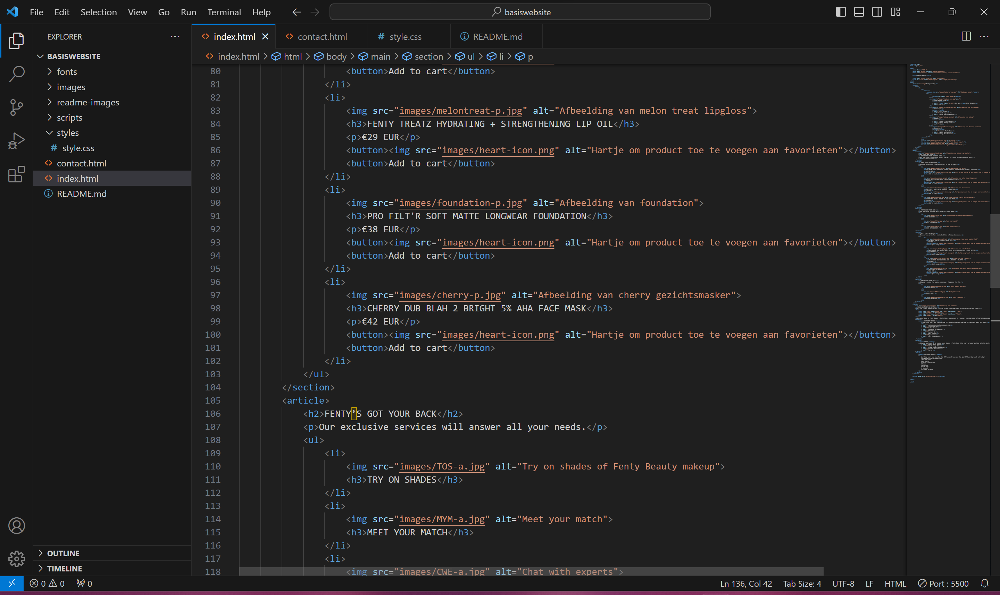
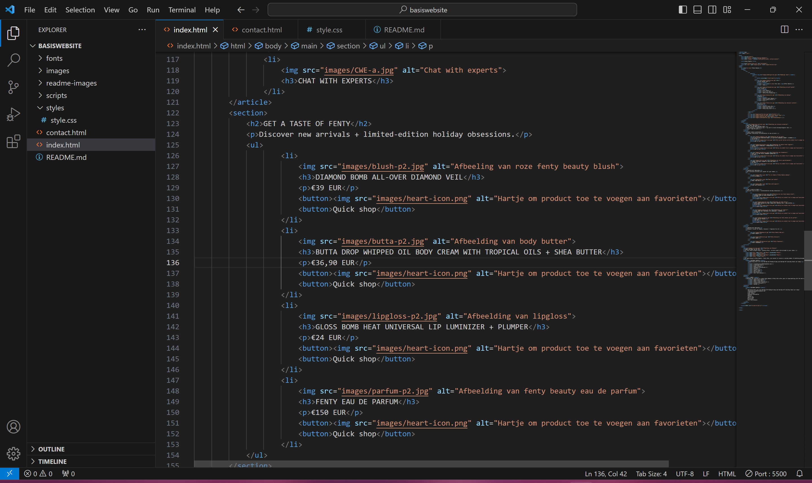
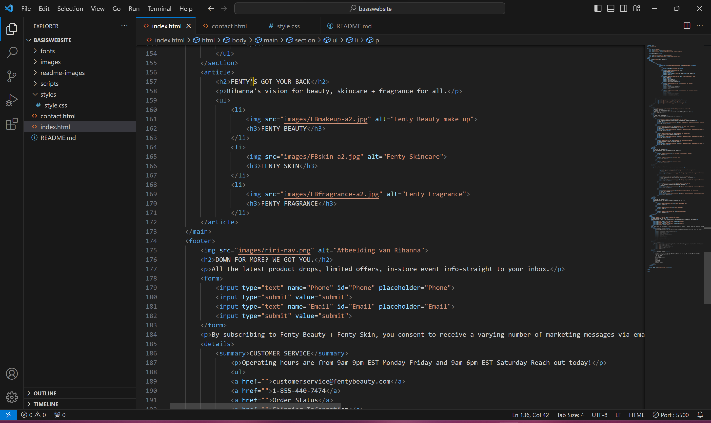
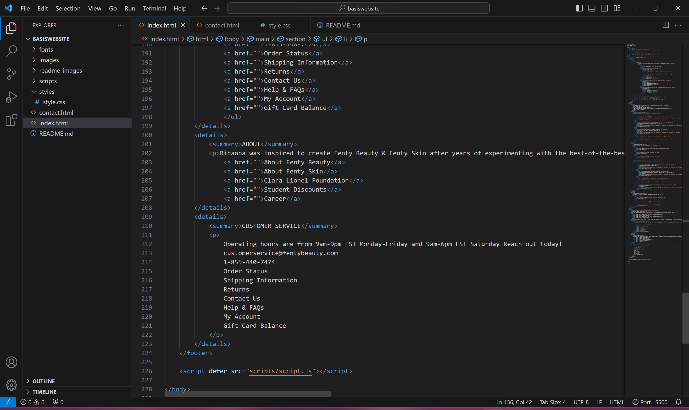
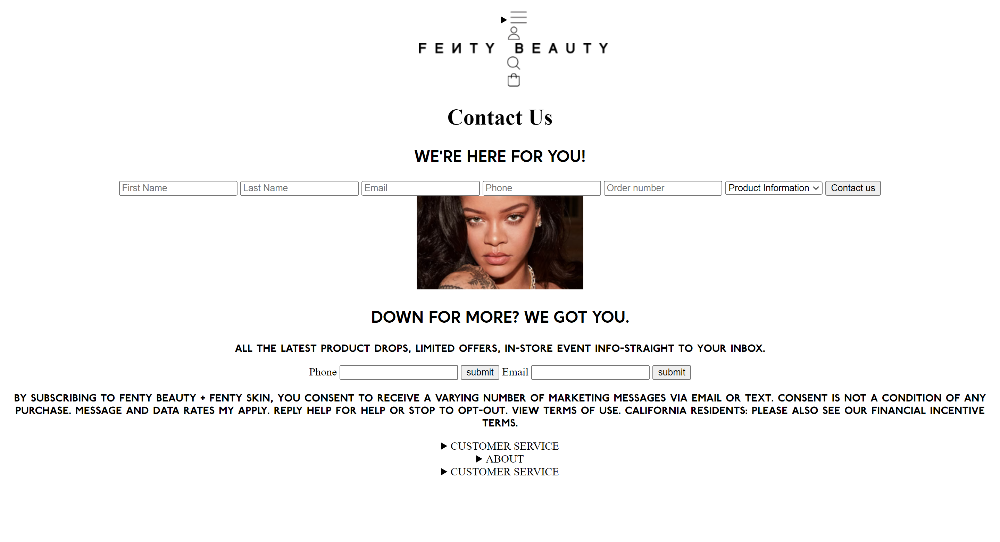
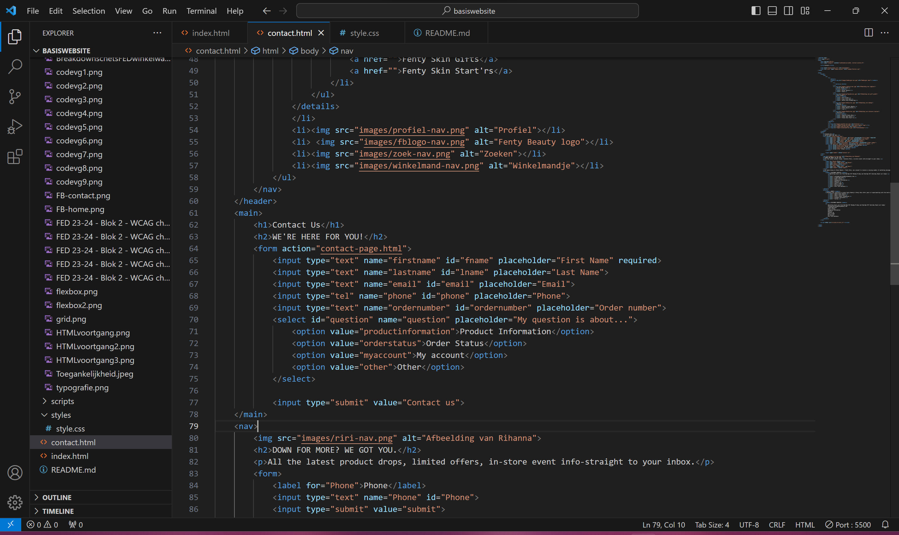
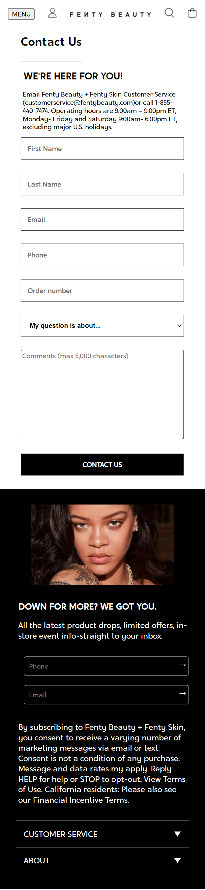
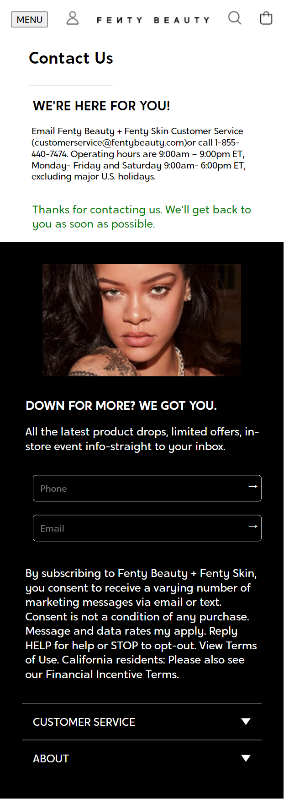

# Procesverslag
Markdown is een simpele manier om HTML te schrijven.  
Markdown cheat cheet: [Hulp bij het schrijven van Markdown](https://github.com/adam-p/markdown-here/wiki/Markdown-Cheatsheet).

Nb. De standaardstructuur en de spartaanse opmaak van de README.md zijn helemaal prima. Het gaat om de inhoud van je procesverslag. Besteedt de tijd voor pracht en praal aan je website.

Nb. Door *open* toe te voegen aan een *details* element kun je deze standaard open zetten. Fijn om dat steeds voor de relevante stuk(ken) te doen.

## Jij

  
uitwerken voor kick-off werkgroep

  ### Auteur:
  Chelsey Hooghart

  #### Je startniveau:
  Blauw

  #### Je focus:
  Surface Plane
 

## Fenty Beauty

  
Ik heb gekozen om de website Fenty Beauty van Rihanna na te maken. De website heeft een groot surface level dus ik ga mijn best doen om hieruit te kiezen wat ik na bouw.

  ### Je opdracht:
  <a href="https://fentybeauty.com/en-nl">Fenty Beauty website</a>

  #### Screenshot(s) van de eerste pagina (small screen): 
  Homepagina  
  

  #### Screenshot(s) van de tweede pagina (small screen):
  Contact  
  
 

## Toegankelijkheidstest 1/2 (week 1)

  
uitwerken na test in 2e werkgroep

  ### Bevindingen
  Lijst met je bevindingen die in de test naar voren kwamen:
  
  
  ### Formulier
  
  
  
  
  

## Breakdownschets (week 1)

  
uitwerken na afloop 3e werkgroep

  ### de hele pagina: 
  
  
  
  ### dynamisch deel (bijv menu): 
  

  ### wellicht nog een dynamisch deel (bijv filter): 
  

## Voortgang 1 (week 2)

  
uitwerken voor 1e voortgang

  ### Stand van zaken
  De afgelopen weken heb ik filmpjes gekeken en oefeningen gemaakt in codepen. Omdat ik best wel lang niet gecodeerd heb hebben de oefeningen  mij wel erg geholpen om het weer op te frissen.
  
  Typografie oefening:
   

  Flexbox oefening:
  
  

  Grid oefening:
  

   Ook heb ik mijn breakdownschets gemaakt. Ik heb een aantal kleine dingen aangepast over hoe ik dus niet meerdere H1's kan maken. Per pagina mag je maar 1 H1 en ik had er meerderen. Deze heb ik vervangen voor H2's. Voor de rest was de feedback wel positief over de breakdownschets. Ik ben zelf nog een beetje onzeker of ik wel zo'n complexe website zou kunnen coderen en of het haalbaar was voor de blauwe piste. De docent heeft mij verteld dat het wel gewoon te doen is dus ik zal mijn best doen.

  ### Verslag van meeting
  hier na afloop snel de uitkomsten van de meeting vastleggen

  - Artiekelen mogen in secties en andersom. 
  - Let op dat je begint met custom properties.
  - In de oefeningen staat 80% van code die je nodig hebt voor je site.
  - Verrander de H1s naar H2 en zet een H1 op hidden.

## Voortgang 2 (week 3)

  
uitwerken voor 2e voortgang

  ### Stand van zaken
  Hier ben ik begonnen met het schrijven van mijn HTML. Ik heb geprobeerd om de navigatie de coderen. 
  
  
  De HTML code: 
  
  
  

  ### Verslag van meeting
  hier na afloop snel de uitkomsten van de meeting vastleggen

  - Tip over het stijlen van het hamburger menu met details en summary
  - Winkelmandje weghalen of met extra tijd doen
  - Flexbox justify content center gap 0.5 em
  - a gebruiken in de nav

## Toegankelijkheidstest 2/2 (week 4)

  
uitwerken na test in 9e werkgroep

  ### Bevindingen
  Lijst met je bevindingen die in de test naar voren kwamen (geef ook aan wat er verbeterd is):

## Voortgang 3 (week 4)

  
uitwerken voor 3e voortgang

  ### Stand van zaken
  Ik heb mijn HTML van beiden pagina's afgemaakt alleen moet dus nog best veel doen aan de styling. Ik had in de vakantie niet kunnen werken aan school, omdat ik erg ziek was geworden dus kon niet veel voortgang laten zien tijdens het laatste voortgangsgesprek. Wel heb ik goeie feedback gekregen over dat ik de screenreader tag moet gebruiken in de HTML en moet focussen op de toegankelijkheid voor de toegankelijkheidstest. Dit is belangrijk voor bij de beoordeling dus daar ga ik nu aanwerken en dan de styling van de webpagina. 

  Homepagina:
  Dit is hoe de complete homepagina eruit ziet voor nu ik heb de afbeeldingen en fonts kunnen toevoegen maar de pagina moet dus nog wel met CSS gestijld en gepositsioneerd  worden.
  

  HTML van homepagina:
  Ik had als feedback gekregen dat ik niet voor alle afbeeldingen een alt moet gebruiken. Dit zei mijn docent omdat als de screenreader de afbeelding voorleest en het is gewoon bedoeld als opmaak van de website kan dit verwarrend zijn voor een blind persoon. Blinden kunnen dan denken dat de tekst bedoeld is voor de afbeelding terwijl sommige afbeeldingen niets te maken hebben met de content. Ook zou ik screenreader tags moeten toevoegen aan de HTML.

  
  
  
  
  
  

  Contactpagina: 
  Dit is hoe de contactpagina eruit ziet voor nu het is een korte pagina met een werkend formulier. Ik zou dus alleen nog dit werkend moeten maken.
  

  HTML van contactpagina:
  

  ### Verslag van meeting
  hier na afloop snel de uitkomsten van de meeting vastleggen

  - Leesbare site met de screenreader
  - Wat hoor ik bij de HTML
  - Letten op afbeelding alt screenreader
  - Class met screenreader only
  - Custom properties gebruiken

## Voortgang
De voortgang die ik de afgelopen paar dagen gemaakt heb heeft dus te maken met de css stijling. Ik heb hier dus de pagina's afgemaakt. Ik moet dus wel de overige surface plane elemneten toepassen en dat ga ik dus nog toepassen met css en javascript regels.

Homepagina:

Contactpagina deel 1:

Contactpagina deel 2:

## Eindgesprek (week 5)

  
uitwerken voor eindgesprek

  ### Je uitkomst - karakteristiek screenshots:
  

  ### Dit ging goed/Heb ik geleerd: 
  Korte omschrijving met plaatjes

  

  ### Dit was lastig/Is niet gelukt:
  Korte omschrijving met plaatjes

  

## Bronnenlijst

  
continu bijhouden terwijl je werkt

  Nb. Wees specifiek ('css-tricks' als bron is bijv. niet specifiek genoeg). 
  Nb. ChatGpT en andere AI horen er ook bij.
  Nb. Vermeld de bronnen ook in je code.

  1. bron 1
  2. bron 2
  3. ...

